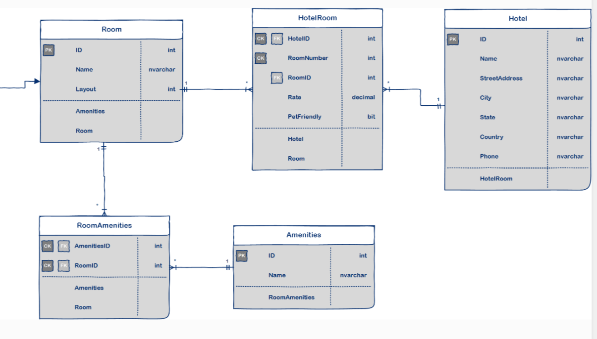

# Async Inn Management System

Bulding a RESTful API hotel server that will increase the managmement of the assets in the hotel.

Increatse the ability to modify and manage rooms, amenities, and new hotel locations built.

## ERD

**Explanation**

The hotel “Async Inn” has different location.

**Hotel**: Represent different location of the hotel, every *Hotel* has multiple *Room*.

**Room**: Represent the rooms inside the hotel, every *Room* has multiple *Amenity*.

**Amenity**: Represent the amenities inside each *Room*.

PK: *The primary key is the column that contain values that uniquely identify each row in a table*

FK: *The foreign key is a field in one table, that refers to the PK in another table. The table with the foreign key is called the child table, and the table with the primary key is called the referenced or parent table.*

## Architecture
### Dependency Injection
- Dependency injection is basically providing the objects that an object needs (its dependencies) instead of having it construct them itself. 

It's a very useful technique for testing, since it allows dependencies to be mocked or stubbed out.

- It is a programming technique *(Design Pattern)* that makes a class independent of its dependencies.

### The advantages/benefits of dependency injection are:
- Increase the usability, testability and maintainability of the system.
- It allows dependencies to be mocked or stubbed out.
- Ability to replace dependencies, without changing the class that uses it.
- Promotes "Code to interface not to an implementation" principle.
